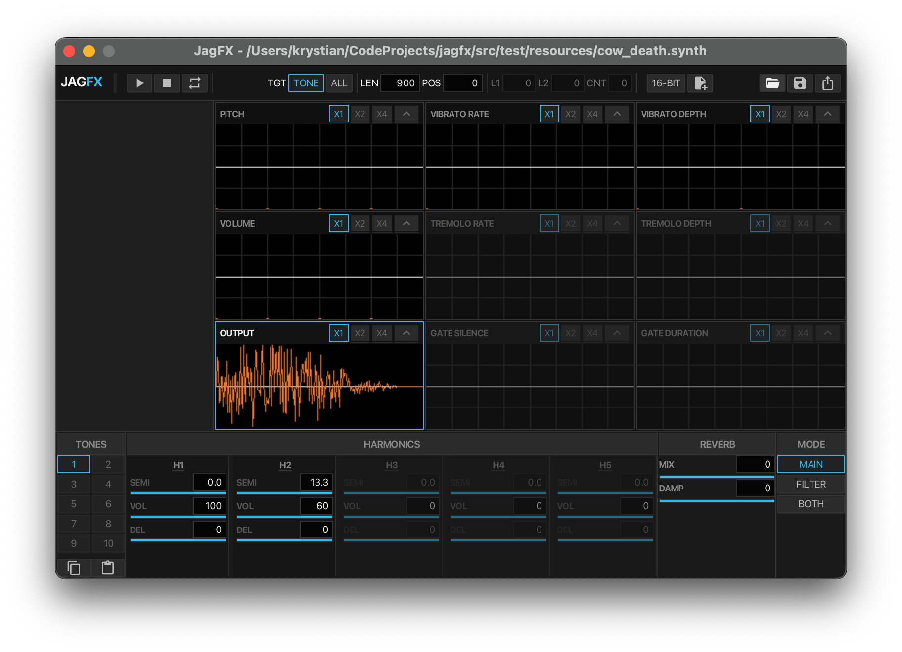

# Jagex Additive Synthesizer

<p align="left">
  
</p>
<https://raw.githubusercontent.com/xsyetopz/jagfx-scalafx/main/assets/ice_barrage.mp4>

Clear and powerful tool for working with Jagex Audio Synthesis files. Allows you to view, play, and convert `.synth` files to `.wav`.

## Prerequisites

Before you start, make sure you have following installed:

- **Java Development Kit (JDK) 21** or higher.
- **sbt** (Scala Build Tool) 1.11 or higher.
- **Node.js** (for `npx`) or `bun` (for `bunx`). Required to compile visual styles (SCSS).

## Getting Started

### 1. Build Project

Open your terminal in project folder and run:

```bash
sbt compile
```

This will download all necessary library dependencies and compile source code.

### 2. Run GUI Application

To launch graphical interface:

```bash
sbt run
```

This opens main JagFX synthesizer window where you can:

- **Load** `.synth` files.
- **Play** and loop audio tracks.
- **Visualize** waveforms and envelopes.
- **Export** to `.synth` and/or `.wav`.

### 3. Run CLI Tool

JagFX includes command-line interface for batch converting files without opening GUI.

**Command Format:**

```bash
sbt "cli <input.synth> <output.wav> [loopCount]"
```

**Examples:**

Convert file once:

```bash
sbt "cli input.synth output.wav"
```

Convert file and loop it 4 times:

```bash
sbt "cli input.synth output_looped.wav 4"
```

### 4. Run Tests

To verify that everything is working correctly:

```bash
sbt test
```

## Creating Standalone App

You can package JagFX as standalone application that does not require `sbt` to run.

1. **Stage application:**

    ```bash
    sbt stage
    ```

2. **Run generated binary:**

    - **Mac/Linux:** `./target/universal/stage/bin/jagfx` (GUI) or `./target/universal/stage/bin/jagfx-cli` (CLI)
    - **Windows:** `.\target\universal\stage\bin\jagfx.bat`

## Project Structure

Here is quick overview of key folders:

```text
src/main/
├── scala/jagfx/
│   ├── io/                 # Handles reading/writing binary .synth files
│   ├── model/              # Data structures (Tones, Envelopes)
│   ├── synth/              # Audio synthesis engine (DSP)
│   ├── ui/                 # GUI controllers and views
│   ├── JagFX.scala         # GUI Entry point
│   └── JagFXCli.scala      # CLI Entry point
└── scss/                   # Stylesheets for UI
```

## License

This project is licensed under MIT License. See `LICENSE` file for more details.
