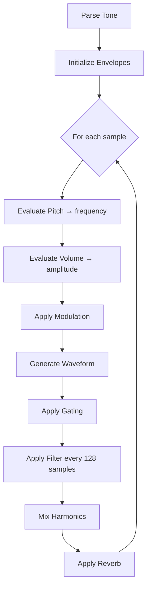

# Jagex .synth File Format Specification

Reverse-engineered from RuneScape cache files (317 client reference).

## Overview

Binary format for synthesized sound effects. Contains up to **10 instrument voices ("tones")** with envelope-controlled pitch, amplitude, modulation, and IIR filtering.

**Byte Order**: Big Endian
**Sample Rate**: 22,050 Hz (fixed)

---

## Data Types

| Type | Size | Description |
|------|------|-------------|
| `u8` | 1 | Unsigned 8-bit |
| `u16` | 2 | Unsigned 16-bit BE |
| `s32` | 4 | Signed 32-bit BE |
| `smart` | 1-2 | Variable unsigned: `<128` = byte; else `((b-128)<<8) + next` |
| `ssmart` | 1-2 | Variable signed: `<128` = byte-64; else `((b<<8)+next) - 49152` |

---

## File Structure

```
┌──────────────────────────┐
│  Tone Slots [0..9]       │  10 slots, each starts with presence byte
├──────────────────────────┤
│  Loop Begin (u16)        │  ms
│  Loop End (u16)          │  ms
└──────────────────────────┘
```

### Tone Slot Detection

- `0x00`: Empty (1 byte consumed)
- `!= 0x00`: Tone follows (byte NOT consumed—rewind)

---

## Tone Definition

| Field | Type | Notes |
|-------|------|-------|
| Pitch Envelope | `Envelope` | Frequency trajectory |
| Volume Envelope | `Envelope` | Amplitude trajectory |
| Vibrato | `OptPair` | Rate + Depth |
| Tremolo | `OptPair` | Rate + Depth |
| Gate | `OptPair` | Silence + Duration |
| Harmonics | `Harmonic[]` | Max 10, terminated by vol=0 |
| Reverb Delay | `smart` | ms |
| Reverb Volume | `smart` | 0-100 |
| Duration | `u16` | ms |
| Start Offset | `u16` | ms |
| Filter | `Filter` | Optional IIR |

**OptPair**: Peek byte. `0x00`=absent (consume 1), else two Envelopes.

---

## Envelope

| Field | Type |
|-------|------|
| Form | `u8` | 0=Off, 1=Square, 2=Sine, 3=Saw, 4=Noise |
| Start | `s32` |
| End | `s32` |
| Segment Count | `u8` |
| Segments | `Segment[]` |

### Segment

**Order**: Duration BEFORE Peak (317 format).

| Field | Type | Range |
|-------|------|-------|
| Duration | `u16` | Absolute phase (0-65535) |
| Peak | `u16` | Interpolation (0=Start, 65535=End) |

### Envelope Evaluation (Runtime)

1. `amplitude = segments[0].peak` (initial)
2. `segmentIdx = 0`, `step = 0`
3. Each sample:
   - `step++`
   - If `step >= targetTime`: advance `segmentIdx++`, recalculate `delta`
   - `amplitude += delta`
4. Return: `start + (amplitude * (end - start)) >> 15`

---

## Filter

IIR filter with up to 4 pole pairs per direction.

| Field | Type | Notes |
|-------|------|-------|
| Count | `u8` | `pairCount0 = count>>4`, `pairCount1 = count&0xF` |
| Unity | `u16[2]` | Gain (start, end) |
| Mask | `u8` | Dynamic pole flags |
| Base Poles | `u16[2]` * pairs | Phase, Magnitude per pair |
| Target Poles | conditional | If masked, read target values |
| Envelope | `Envelope` | If mask≠0 or unity differs |

**If count=0**: No filter present → `None`.

### Filter Application (Runtime)

Coefficients updated every **128 samples**:

1. Interpolate unity gain via envelope
2. Compute feedforward/feedback coefficients
3. Apply IIR: `y[n] = b0*x[n] + b1*x[n-1] + ... - a1*y[n-1] - ...`

---

## Harmonics

Loop until `volume = 0`:

| Field | Type | Notes |
|-------|------|-------|
| Volume | `smart` | 0=end, 1-100% |
| Semitone | `ssmart` | Decicents (10 = 1 semitone) |
| Delay | `smart` | Phase offset (ms) |

---

## Gating (Runtime)

Controls amplitude on/off switching using `gateSilence` and `gateDuration` envelopes:

```text
muted = true
for each sample:
  silenceVal = gateSilence.evaluate()
  durationVal = gateDuration.evaluate()

  if muted && silenceVal < durationVal:
    muted = false
  elif !muted && silenceVal >= durationVal:
    muted = true

  if muted: sample = 0
```

---

## Synthesis Flow



---

## Units

| Parameter | Unit | Notes |
|-----------|------|-------|
| Frequency | JPU | Hz ≈ value * 22.05 |
| Semitone | Decicents | 120 = 1 octave |
| Duration | ms | Direct |
| Peak | 0-65535 | Normalized |

---

## Loop

- If `begin < end`: Region repeats
- If `begin >= end` or 0: Single playback
